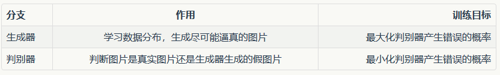
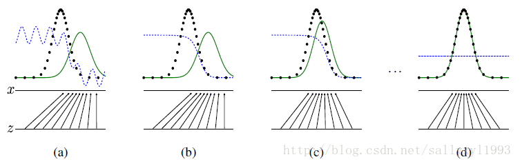
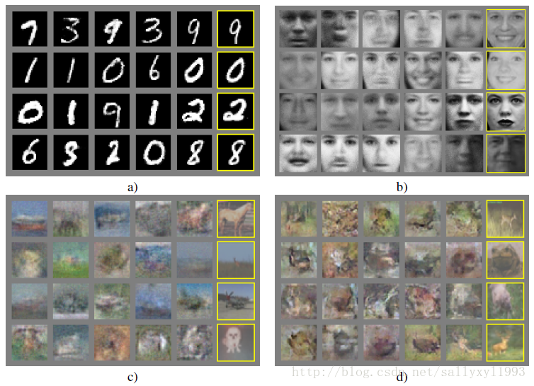
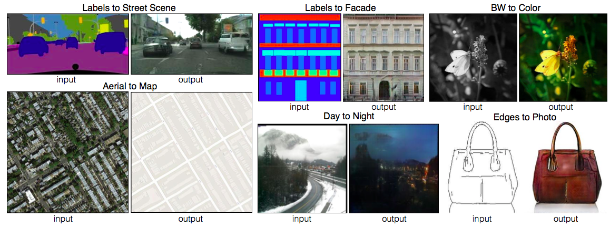
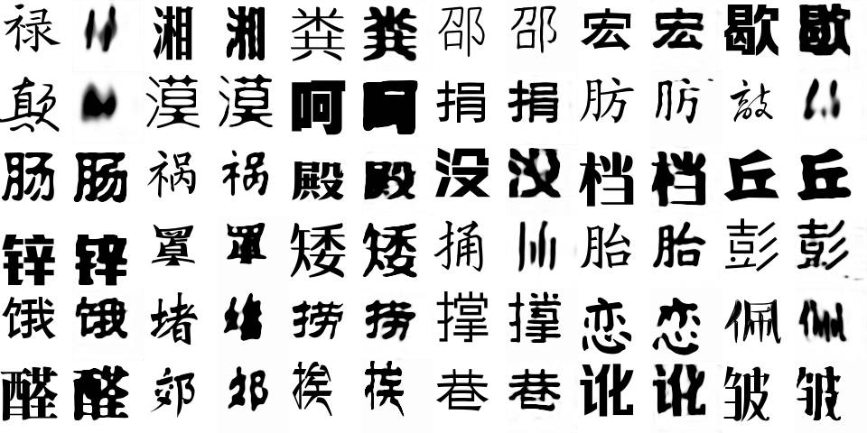
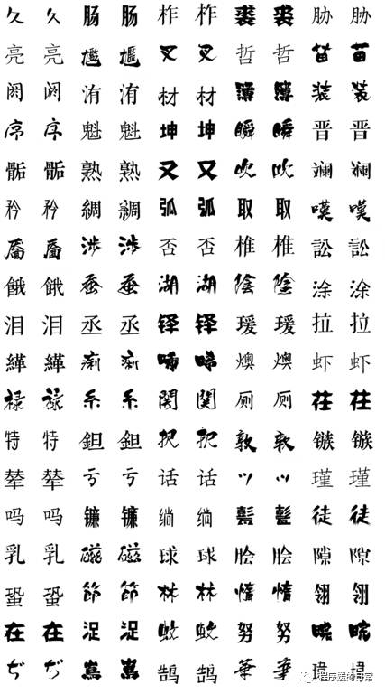
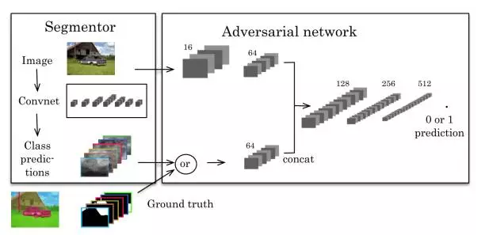
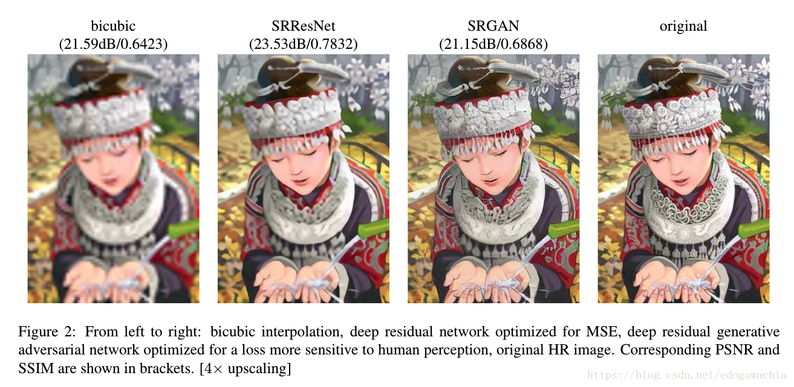
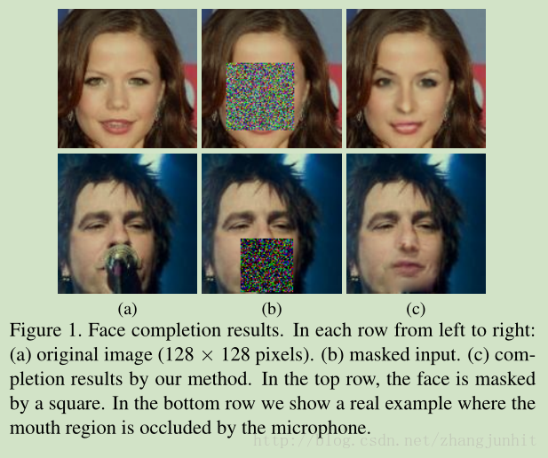
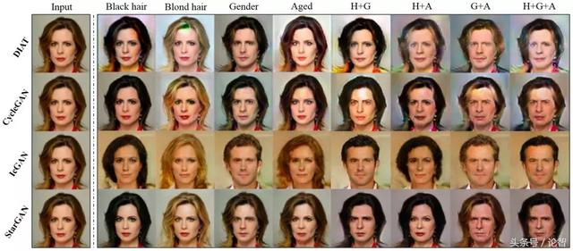

### **GAN系列论文阅读**
**GAN开山鼻祖**：[Generative Adversarial Networks](https://arxiv.org/abs/1406.2661)

**作者**：Ian J. Goodfellow（第一作者，单位蒙特利尔大学）

**想法来源** ：最初想法是如何让机器自动生成逼真的图片，如果是使用统计学的方法，那么需要考虑的统计量太大，无法实现，因此他想到使用神经网络来解决这个问题。

**基础原理** ：GAN网络分为两个分支进行博弈，两个分支分别为Generatotor(生成器)和Discriminator（判别器），具体见下表。博弈的结果使生成器生成的图片让判别器真假难以辨别。本质问题是生成模型通过观测数据学习样本和标签的联合概率分布P（X,Y），训练好的模型能够生成符合样本分布的新数据。文章在相关工作中介绍以前工作中的生成模型有变分自编码器和自回归模型（现在这两种方法还不太清楚，有待补充）。

  
 
 - 模型参数定义

  data→真实数据（groundtruth）
  
  pdata→真实数据的分布
  
  z→噪声（输入数据）
  
  pz→原始噪音的分布
  
  pg→经过生成器后的数据分布
  
  G()→生成映射函数
  
  D()→判别映射函数
  
 - 目标函数
 
   minG maxD V(D,G)=Ex~pdata(x)[log D(x)]+Ez~pz(z)[log (1-D(G(z)))]

   体现最大最小博弈问题
   
   E代表期望，等号右侧前半部分表示真实样本，后半部分表示虚假样本。
   
   对于判别器来说，希望最大等号右侧，对于生成器来说，希望最小等号右侧。

- 生成器和判别器两者交替训练过程

黑色曲线是真实样本的概率分布函数，绿色曲线是虚假样本的概率分布函数，蓝色曲线是判别器的输出，值越大表明判别真实样本的概率越大。
从图中可以看出，训练开始时，判别器和生成器的能力都比较弱，因此蓝色曲线波动较大，随着生成器生的图片越来越逼真，最后判别器对真实图片判别的概率为0.5。

**GAN存在的优势和缺点**
 - 优势
 1. 相比于其他模型，产生的图片更加逼真
 2. 不需要设计任何数学上的模型，可自主学习
 3. 不需要利用马尔可夫链反复采样，学习过程无需推断，回避了近似计算棘手的概率的难题。
 - 缺点
1. 解决不收敛（non-convergence）的问题。
当博弈双方都由神经网络表示时，在没有实际达到均衡的情况下，让它们永远保持对自己策略的调整是可能的。GAN很难达到纳什均衡。
（纳什均衡：核心要素在于，我们做出决策的时候总是要基于他人的决策，把他的决策看成一个常数，选择策略最大化自己的收益。当每一个人都这么做的时候，纳什均衡就产生了。判断纳什均衡的标准是，给定其他人的最优策略，如果每一个参与者都没有意愿改变自己的策略，那种这些策略组合就是纳什均衡）

2. 难以训练：崩溃问题（collapse problem）  
GAN模型被定义为极小极大问题，没有损失函数，在训练过程中很难区分是否正在取得进展。GAN的学习过程可能发生崩溃问题（collapse problem），生成器开始退化，总是生成同样的样本点，无法继续学习。当生成模型崩溃时，判别模型也会对相似的样本点指向相似的方向，训练无法继续。

3. 无需预先建模，模型过于自由不可控。  
与其他生成式模型相比，GAN这种竞争的方式不再要求一个假设的数据分布，而是使用一种分布直接进行采样，从而真正达到理论上可以完全逼近真实数据，这也是GAN最大的优势。然而，这种不需要预先建模的方法缺点是太过自由了，对于较大的图片，较多的 pixel的情形，基于简单 GAN 的方式就不太可控了(超高维)。

**GAN的实际应用**

GAN设计的初衷是图像合成。可应用于有监督和无监督，从此两个方面进行分类。
- 无监督

无监督的输入为随机数字，无需标注。如下图生成结果。

右侧黄框为真实数据，左侧为生成的虚假图片。

当样本维数比较高时，GAN 表现不是很好。

- 有监督

有监督的输入和输出都为图像，可概括说为图像翻译。根据应用场景不同，输入输出不同，即有监督需要标注。

图像翻译指图像内容从一个域迁移到另一个域，可以看成是图像移除一个域的属性 ，然后赋予另一个域的属性。本质上，图像翻译的工作可直接由一般的CNN网络来完成，但是生成的图像不够逼真，效果没有使用GAN好。

 1.pix2pix 系列
 [Image-to-Image Translation with Conditional Adversarial Networks](https://arxiv.org/pdf/1611.07004v1.pdf)
 
 [附公开DEMO](https://affinelayer.com/pixsrv/)
 生成器可使用Encoder-Decoder,Unet等。
 本文中的应用场景包括以下几个方面：
 
 语义标注图-->街景图
 
 语义标注图-->墙体图 

 灰度图-->彩色图
  
 航拍图-->地图
 
 白天-->夜景
  
 边缘图-->实体图
 
 
 
 2. 合成字体
 [zi2zi: Master Chinese Calligraphy with Conditional Adversarial Networks](https://kaonashi-tyc.github.io/2017/04/06/zi2zi.html)
 合成字体的问题：
 
 合成的字体单一，字体风格变化有限如下图所示：
 
 
 当合成的多种风格的字体时，各种风格之间模糊，如果要合成多种风格并保证每种风格的合成质量，
 
 解决方法为<b>类别嵌入一对多建模</b>
 
 当同一个汉字可以出现在多种字体当中， pix2pix 模型并没有解决这种一对多的关系。
 
 “类别嵌入”（category embedding）的方法，将不可训练的高斯噪声作为风格嵌入（style embedding）与汉字嵌入（character embedding）串联起来，之后再一并进入解码器。解码器仍旧将同一个汉字映射为同一个向量，但是，解码器会同时考虑汉字和风格两个嵌入来生成目标汉字。生成结果如下图所示：
  
  
 
 
 3.图像分割
 
 
 
 4. 图像超分辨率
 

 5.人脸合成
 
 人脸修复
 
 
 
 多域人脸合成
 
 StarGAN，一种可扩展的、只用一个模型就能执行多个域图片到图片转换任务的方法。StarGAN允许来自不同域的多个数据集在同一个神经网络内并行训练，而其生成器也能充分利用来自5个域的图像特征。
  
 
**GAN系列典型文章**
- [CGAN - Conditional Generative Adversarial Nets](https://arxiv.org/abs/1411.1784)

主要贡献：原始GAN为无条件生成模型，对所生成的数据的模式没有控制，本文通过在添加类标签等辅助信息，指导数据生成过程，即可以生成定向样本。

|    模型        | 生成器输入     | 判别器输入  | 损失函数 |
| ------------- |:-------------:| -----:|-----:|
| GAN  | 噪声z|真实(data)/生成假数据 |Ex~pdata(x)[log D(x)]+Ez~pz(z)[log (1-D(G(z)))]|
| CGAN | z，条件变量y|真实/生成假数据,y|Ex~pdata(x)[log D(x/y)]+Ez~pz(z)[log (1-D(G(z/y)))] |

- [DCGAN - Unsupervised Representation Learning with Deep Convolutional Generative Adversarial Networks](https://arxiv.org/abs/1511.06434)

主要贡献：（1）改进GAN的网络结构，极大的提高了GAN训练的稳定性和生成结果质量。

（2）表明生成的特征具有向量的计算特性。

网络结构的改进：

- 使用卷积层代替全连接
- 网络中没有池化和上采样的存在，使用带步长卷积代替
- 使用BN操作

- [WGAN -Wasserstein GAN ](https://arxiv.org/pdf/1701.07875.pdf)

主要贡献：属于理论推导论文，解决传统GAN的训练难和训练过程不稳定的过程，主要从损失函数的角度进行了改进。
损失函数改进后即使使用全连接层也能表现出较好的结果。
（1）从理论上给出了GAN训练不稳定的原因，即交叉熵（JS散度）不适合衡量具有不相交部分的分布之间的距离，转而使用wassertein距离去衡量生成数据分布和真实数据分布之间的距离，理论上解决了训练不稳定的问题。
（2）解决了模式崩溃的（collapse mode）问题，生成结果多样性更丰富。
（3）对GAN的训练提供了一个指标，此指标数值越小，表示GAN训练的越差，反之越好。
改进点：
（1）生成器和判别器的loss不取log
(2) 对更新后的权重强制截断到一定范围内，比如[-0.01，0.01]，以满足论文中提到的lipschitz连续性条件。

