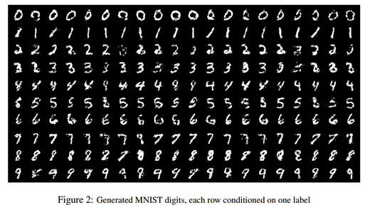

### **GAN系列论文阅读**
**CGAN**：[Conditional Generative Adversarial Nets](https://arxiv.org/abs/1411.1784)

**作者**：Mehdi Mirza（第一作者，单位蒙特利尔大学）

**解决问题** ：原始GAN 不需要预先建模，存在的缺点生成的图片太过自由，没有限制，
（1）对于较大的图像，基于原始的GAN不可控
（2）不能根据具体指定来生成图像。

**基础原理** ：将原始GAN的无监督问题变为有监督问题，CGAN为一种带条件约束的生成对抗模型，加入额外的条件变量对生成数据进行知道。
例如给图像加入类别标签，多模态数据

通过将额外信息 y 输送给判别模型和生成模型,作为输入层的一部分,从而实现条件GAN。

 - 目标函数
 
   minG maxD V(D,G)=Ex~pdata(x/y)[log D(x)]+Ez~pz(z)[log (1-D(G(z/y)))]
  
 - 实验结果
 

 **贡献**：这个简单直接的改进被证明非常有效,并广泛用于后续的相关工作中.

