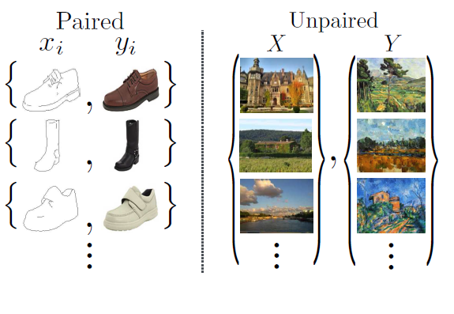
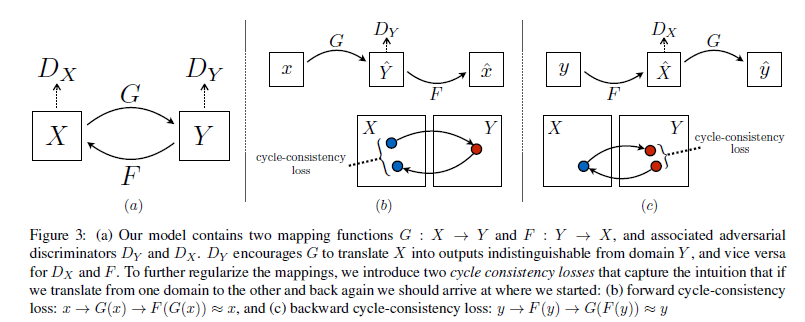
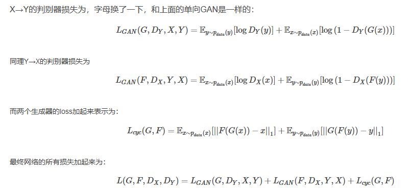
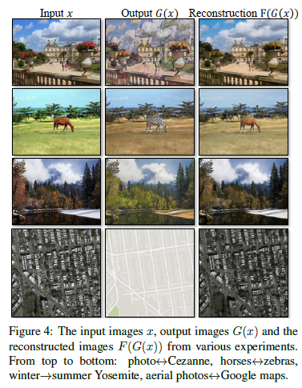

### **GAN系列论文阅读**
**Cycle-GAN**： [Unpaired Image-to-Image Translation using Cycle-Consistent Adversarial Networks](https://arxiv.org/abs/1703.10593)

**作者**：Jun-Yan Zhu（第一作者，单位Berkeley AI Research (BAIR) laboratory, UC Berkeley）

**贡献** ： 传统图像翻译的生成对抗网络需要配对的输入与输出，但是实际中并不总是存在成对的数据可供训练。

Cycle-GAN 提供了一种更实用的图片生成模式，本质上是两个集合间的映射，而不是两张图像之间的映射。
 

**基础原理** ：

   提出循环一致性：task:域X-->域Y
   
   G：X-->y
   
   F: Y-->X
   
   F(G(X)) \approx X
   
   G(F(Y)) \approx Y
   
   
   
**损失函数**：

**结果**：

   
   
   
