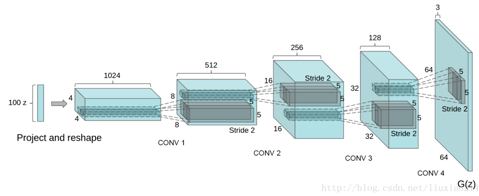

### **GAN系列论文阅读**
**CGAN**：[ Unsupervised Representation Learning with Deep Convolutional Generative Adversarial Networks](https://arxiv.org/abs/1511.06434)

**作者**：Alec Radford（第一作者，单位indico Research）

**解决问题** ：原始GAN训练不稳定，解决训练不收敛问题

**基础原理** ：改进网络结构。

从以下几个方面改进，从而得到稳定的GAN架构：
- 所有的pooling层使用步幅卷积(判别网络)和微步幅度卷积(生成网络)进行替换。

- 在生成网络和判别网络上使用批处理规范化。

- 对于更深的架构移除全连接隐藏层。

- 在生成网络的所有层上使用RelU激活函数，除了输出层使用Tanh激活函数。

- 在判别网络的所有层上使用LeakyReLU激活函数。

**网络结构**

