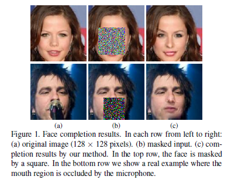
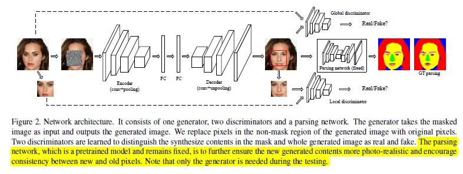
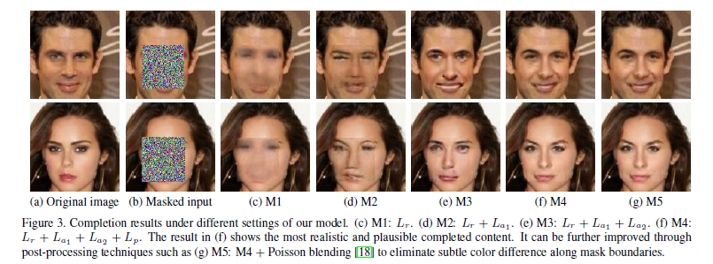

### **GAN系列论文阅读**
**人脸修复**： [Generative Face Completion](https://arxiv.org/abs/1704.05838)

**作者**：Yunjey Choi（第一作者，加利福尼亚大学默塞德分校 ）

**贡献** ：
论文中的模型包括包括一个生成器、两个鉴别器以及一个语义解析网络，可针对缺失图像直接生成局部或整张的逼真图像。

**网络结构** ：

 - 生成器是一个基于vgg-19的自动编码器
 - 局部鉴别器被用来判别图像缺失区域中合成的图像补丁是否真实
 - 整体鉴别器则用来判别整张图像的真实性
 - 语义解析网络用于改进上述生成对抗网络生成的图片

 
 
**结果对比**

 
 
 - c列是单纯使用gan图像翻译，不能确保填充区域在视觉上是真实和连贯的
 - d列是加入局部判别器
 - e列是加入语义解析网络

