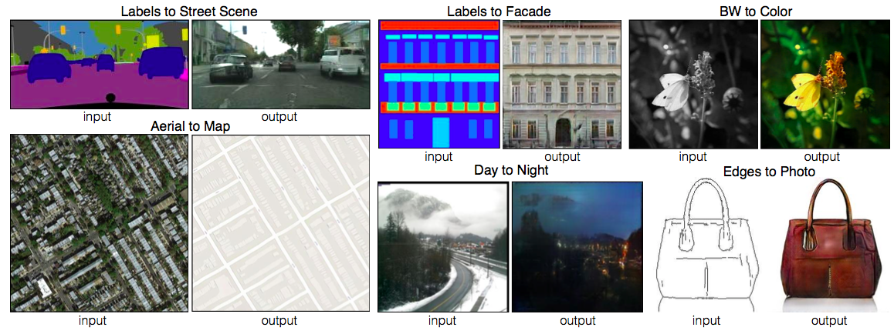
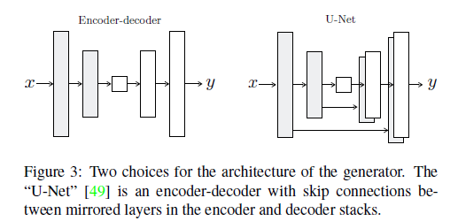
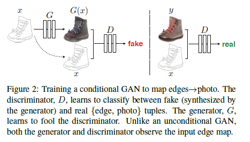

### **GAN系列论文阅读**
**pix2pix**： [Image-to-Image Translation with Conditional Adversarial Networks](https://arxiv.org/pdf/1611.07004v1.pdf)
 [附公开DEMO](https://affinelayer.com/pixsrv/)

**作者**：Ian J. Goodfellow（第一作者，单位蒙特利尔大学）

**应用** ：图像翻译指图像内容从一个域迁移到另一个域，可以看成是图像移除一个域的属性 ，然后赋予另一个域的属性。本质上，图像翻译的工作可直接由一般的CNN网络来完成，但是生成的图像不够逼真，图像边缘模糊，效果没有使用GAN好。

**基础原理** ：GAN网络依旧分为两个分支进行博弈，两个分支分别为Generatotor(生成器)和Discriminator（判别器），生成器可使用Encoder-Decoder,Unet等。
 本文中的应用场景包括以下几个方面：
 
 语义标注图-->街景图
 
 语义标注图-->墙体图 

 灰度图-->彩色图
  
 航拍图-->地图
 
 白天-->夜景
  
 边缘图-->实体图
 
 

** 网络结构**：
 - 生成器
 
 
 - 判别器
  
  
 使用条件GAN，即输入为（图片，边缘）
 
  - 目标函数
  （1）博弈目标函数
  
   A(G,D)=Ex,y[log D(x,y)]+Ex,z[log (1-D(x,G(x,z)))]
   
   (2) 生成图像监督函数
   
   B(G)=Ex,y,z[||y-G(x,z)||1]
   
   最终目标函数：
   G* = arg min max (G,D) A+ \Lambda * B
