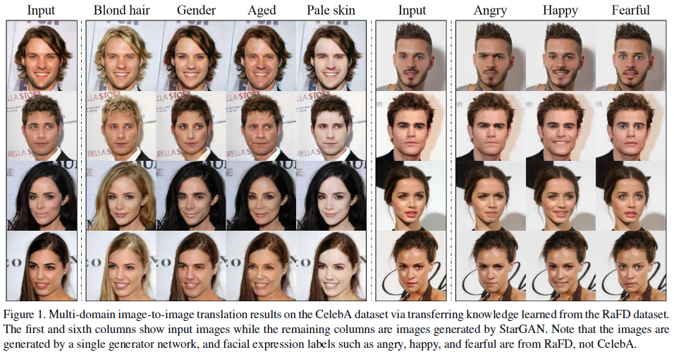
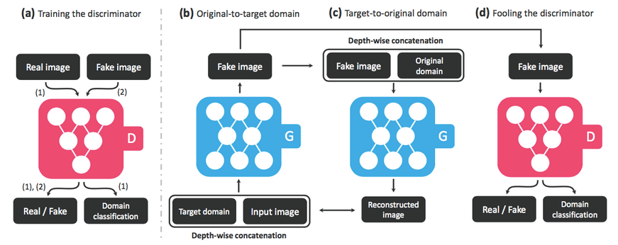
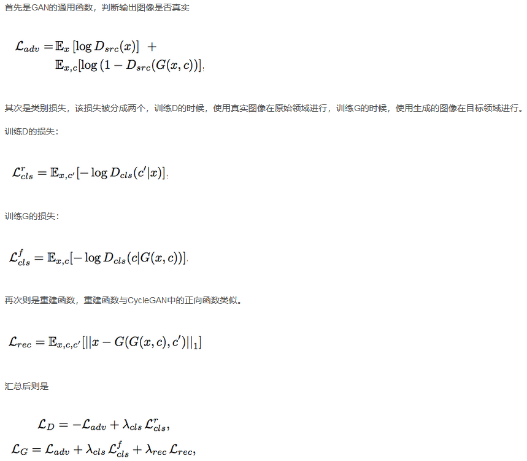
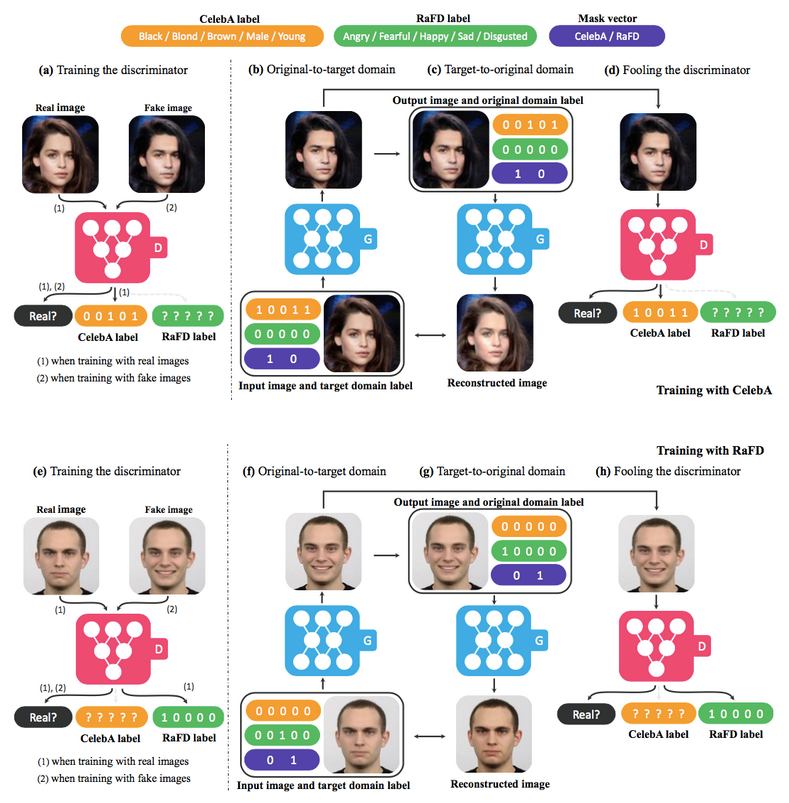

### **GAN系列论文阅读**
**starGAN**： [StarGAN: Unified Generative Adversarial Networks for Multi-Domain Image-to-Image Translation](https://arxiv.org/pdf/1611.07004v1.pdf)

**作者**：Yunjey Choi1（第一作者，首尔大学）

**贡献** ：
Pix2Pix模型解决了有Pair对数据的图像翻译问题；

CycleGAN解决了Unpaired数据下的图像翻译问题。

但无论是Pix2Pix还是CycleGAN，都是解决了一对一的问题，即一个领域到另一个领域的转换。

当有很多领域要转换了，对于每一个领域转换，都需要重新训练一个模型去解决。这样的行为太低效了。

StarGAN就是将多领域转换用统一框架实现的算法。

**基础原理** ：

 - 在G的输入中添加目标领域信息，即把图片翻译到哪个领域这个信息告诉生成模型。
 - D除了具有判断图片是否真实的功能外，还要有判断图片属于哪个类别的能力。这样可以保证G中同样的输入图像，随着目标领域的不同生成不同的效果
 - 除了上述两样以外，还需要保证图像翻译过程中图像内容要保存，只改变领域差异的那部分。图像重建可以完整这一部分，图像重建即将图像翻译从领域A翻译到领域B，再翻译回来，不会发生变化。

 

**目标函数**：

**多数据集训练问题**：
在多数据集下训练StarGAN存在一个问题，那就是数据集之间的类别可能是不相交的，但内容可能是相交的。

比如CelebA数据集合RaFD数据集，前者拥有很多肤色，年龄之类的类别。而后者拥有的是表情的类别。
但前者的图像很多也是有表情的，这就导致前一类的图像在后一类的标记是不可知的。

为了解决这个问题，在模型输入中加入了Mask，即如果来源于数据集B，那么将数据集A中的标记全部设为0.

